::: callout-warning
## Hinweis: Seite im Aufbau

Diese Seite ist noch im Aufbau. Inhalte und Struktur werden derzeit erarbeitet und werden sich ändern.
:::


## Lokale Nutzung ohne Veröffentlichung {#sec-lokal-nutzen}

Nicht alle Open Educational Resources müssen unmittelbar oder dauerhaft öffentlich zugänglich gemacht werden. Die mit den Quarto-Templates erzeugten HTML-Dokumente lassen sich vollständig lokal nutzen und ohne Veröffentlichung in bestehende Arbeitsabläufe integrieren.

Ein Quarto-Projekt liegt dabei als gewöhnlicher Ordner auf dem eigenen Rechner vor. Nach dem Rendern entstehen HTML-Dateien, die sich direkt im Browser öffnen lassen. Es ist keine Server-Infrastruktur erforderlich, und es entsteht keine Abhängigkeit von externen Plattformen oder Diensten.

Diese Form der Nutzung eignet sich besonders, wenn Materialien zunächst intern erarbeitet, gemeinsam abgestimmt oder in Lehr- und Lernkontexten erprobt werden sollen. Auch für Arbeitsgruppen, die noch keine Entscheidung über eine spätere öffentliche Bereitstellung getroffen haben, bietet die lokale Nutzung einen niedrigschwelligen und kontrollierbaren Einstieg.

Ein zentraler Vorteil liegt in der klaren und nachvollziehbaren Ordnerstruktur der Projekte. Inhalte, Metadaten, Abbildungen und gestalterische Elemente sind eindeutig organisiert und bleiben dauerhaft zusammengeführt. Ein gerendertes Projekt kann als ZIP-Archiv weitergegeben werden, etwa per E-Mail oder über institutionelle Austauschplattformen. Die empfangenden Personen benötigen lediglich einen Webbrowser, um die Materialien zu öffnen und zu nutzen.

Die lokale Nutzung bietet zudem einen geeigneten Rahmen, um Quarto schrittweise kennenzulernen. Inhalte können angepasst und Änderungen unmittelbar im Browser überprüft werden, ohne sich mit Fragen der Bereitstellung oder Veröffentlichung befassen zu müssen. Der Einstieg bleibt überschaubar und konzentriert sich auf die Arbeit am Material selbst.

Weitere Gründe für die lokale Nutzung sind die vollständige Kontrolle über Daten und Dateien, der Einsatz auch in geschützten oder nicht öffentlichen Umgebungen, die einfache Archivierung abgeschlossener Arbeitsstände, die langfristige Lesbarkeit unabhängig von einzelnen Plattformen sowie die klare Trennung zwischen Erstellung und späterer Bereitstellung.

Der im [Schnelleinstieg](schnelleinstieg.qmd) beschriebene Workflow ist ausdrücklich auf diese lokale Nutzung ausgelegt. Eine spätere Bereitstellung über Webserver, Lernmanagementsysteme oder andere Plattformen kann jederzeit erfolgen, ist jedoch keine Voraussetzung, um mit den Templates produktiv zu arbeiten.

## Nutzung in Lernmanagementsystemen {#sec-lms}


## Auf GitHub publizieren {#sec-github}

In diesem Abschnitt wird zwischen zwei Ebenen der Bereitstellung auf GitHub unterschieden:

1.  der Bereitstellung des Quarto-Projekts selbst über ein Git-Repository
2.  der Veröffentlichung der daraus erzeugten HTML-Seiten als sogenannte *GitHub Pages*

Nicht jedes Quarto-Projekt, das über ein Git-Repository verwaltet wird, muss auch über die jeweilige Plattform als Website veröffentlicht werden. In vielen Szenarien werden die gerenderten HTML-Seiten über andere Infrastrukturen bereitgestellt, z. B. über eine institutionelle Website, ein Lernmanagementsystem oder eine projektinterne Publikationsplattform.

Die folgenden Abschnitte beschreiben daher sowohl die Bereitstellung des Quarto-Projekts über GitHub als auch optionale Wege zur Veröffentlichung der erzeugten Seiten als GitHub Pages.

::: {.callout-note title="Warum GitHub Pages derzeit die praktikabelste Lösung ist"}

Trotz möglicher Vorbehalte gegenüber einzelnen Plattformen ist die Nutzung von GitHub Pages aktuell der am besten unterstützte Weg zur Veröffentlichung von Quarto-Projekten.

Dies hat vor allem technische Gründe:

-   Der Befehl `quarto publish` ist explizit auf GitHub ausgerichtet und unterstützt GitHub Pages nativ.
-   Für andere Git-basierte Plattformen (z. B. GitLab oder Codeberg) existieren bislang nur wenige etablierte Workflows, und diese werden in der Quarto-Community kaum systematisch unterstützt.
-   Der von Quarto vorgesehene Publish-Workflow stellt sicher, dass jede Änderung an den Daten oder Inhalten im Repository automatisch zu einer Aktualisierung der veröffentlichten Webpage führt.

Für eine reproduzierbare, wartungsarme Bereitstellung ist GitHub Pages daher derzeit die robusteste und am besten dokumentierte Option.
:::

Diese Anleitung beschreibt einen Standard-Workflow, um den Quellcode eines **lokalen Quarto-Projekts** erstmals auf GitHub zu veröffentlichen. Im Anschluss werden die mit Quarto erzeugten HTML-Seiten automatisiert mit GitHub Actions als GitHub Pages publiziert.

Der Ausgangspunkt ist ein **lokales Verzeichnis**, das bisher **nicht** mit einem GitHub-Repository verknüpft ist.

### Voraussetzungen

:white_check_mark: Auf Ihrem lokalen Rechner:

-   ein [GitHub-Account](https://github.com/signup)
-   [Git](https://github.com/git-guides/install-git) ist installiert
-   [Quarto](https://quarto.org/docs/get-started/) ist installiert
-   ein lauffähiges Quarto-Projekt in einem lokalen Verzeichnis (`quarto render` liefert keine Fehlermeldungen)

:white_check_mark: Auf GitHub:

-   Wenn Sie mit Ihrem Account das Repository in einer *Organisation* anlegen wollen: Berechtigung, neue Repositories anzulegen
-   Zugriff auf GitHub Actions und GitHub Pages (bei eigenen, öffentlichen Repositories standardmäßig gegeben)

### Bereitstellung auf GitHub Repository {#sec-github-repo}

**Schritt 1: Lokales Verzeichnis initialisieren**

Wechseln Sie über die Konsole in das lokale Projektverzeichnis und initialisieren Sie ein Git-Repository mit dem Befehl:

``` bash
git init
```

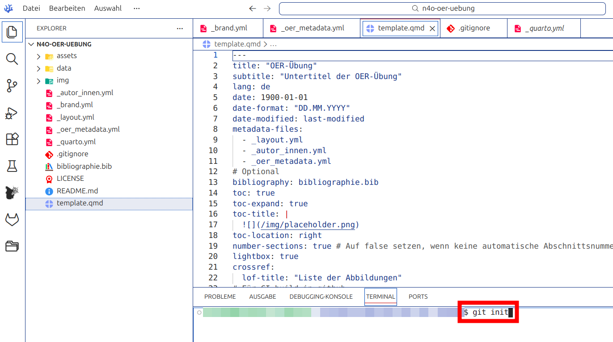

Das Verzeichnis ist nun ein lokales Git-Repository, aber noch nicht mit GitHub verbunden.

**Schritt 2: `.gitignore` hinzufügen**

Aus Gründen der Datensparsamkeit sollten Sie einige lokale Dateien von der Synchronisation mit GitHub ausschließen. Dies erreichen Sie, indem Sie im lokalen Projektverzeichnis eine neue Datei mit dem Namen `.gitignore`anlegen. Übernehmen Sie folgende Angaben in die Datei:

``` bash
_site/
.quarto/
.Rproj.user/
.Rhistory/
.RData/
.DS_Store/
/.luarc.json
_quarto_internal_scss_error.scss
/template_files
**/*.quarto_ipynb
/.quarto/
.venv/
.vscode/

```
Nach dem Speichern der Datei sind die meisten Szenarien abgedeckt. Die genannten Dateien und Verzeichnisse werden nicht mit dem GitHub-Repository synchronisiert.

**Schritt 3: GitHub-Repository anlegen**

::: {.callout-note title="Hinweis zu Repository- und Seiten-URLs"}

Bei GitHub bestehen Repository- und Pages-URLs ausschließlich aus Benutzer- oder Organisationsname und Repository-Name.

Beispiel:

Repository: https://github.com/organisation/quarto-faire-oer-website

Pages-URL: https://organisation.github.io/quarto-faire-oer-website/

Wählen Sie den Repository-Namen daher bewusst und dauerhaft.
:::

Loggen Sie sich über den Browser auf [GitHub](https://github.com) ein und legen ein neues, leeres Repository an:

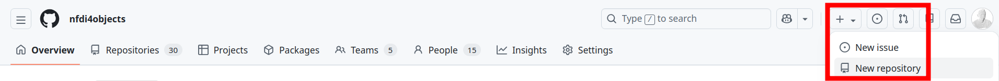

Achten Sie bei den Einstellungen auf

-   ohne README
-   ohne .gitignore
-   ohne Lizenzdatei

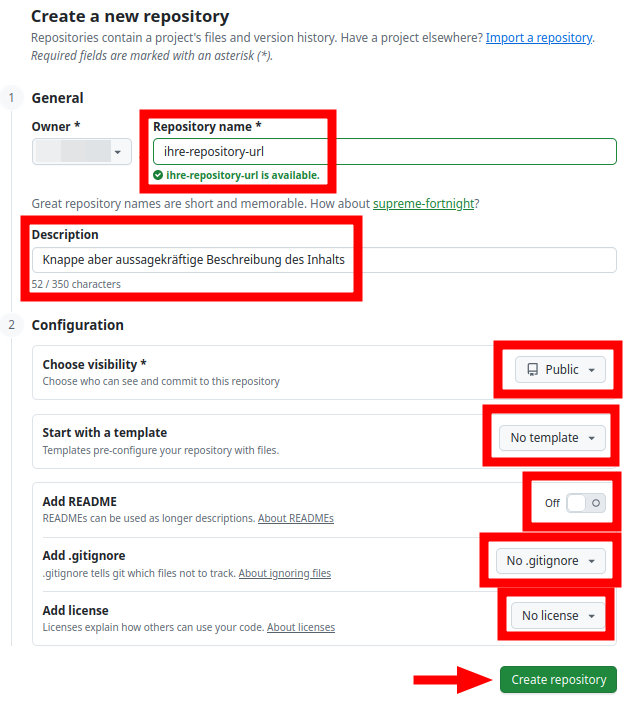

Kopieren Sie die Repository-URL im nächsten Dialog.

Syntax: `https://github.com/username/projektname.git`


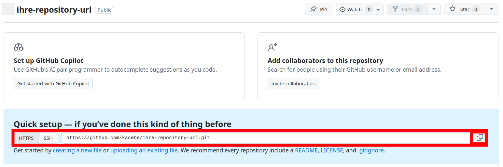

**Schritt 4: Lokales Repository mit GitHub verknüpfen**

Wechseln Sie zurück in die Entwicklungsumgebung und fügen Sie statt `https://github.com/username/projektname.git` ihre Repository-URL in folgenden Befehl ein:

``` bash
git remote add origin https://github.com/username/projektname.git
```

Dieser verknüpft das lokale Repository mit dem GitHub-Repository.

**Schritt 5: Branch festlegen**

Setzen Sie anschließend den Standard-Branch (empfohlen: main):

``` bash
git branch -M main
```

**Schritt 6: Initialer Commit und Push**

Committen Sie den aktuellen Projektstand und pushen Sie ihn zu GitHub:

``` bash
git add .
git commit -m "Initial commit"
git push -u origin main
```

Falls eine Fehlermeldung mit dem Inhalt `RPC failed` auftritt ist das Repository zu groß. In diesem Fall müssen Sie zunächst den Git-Puffer durch den Befehl 

``` bash
git config http.postBuffer 524288000
```
erhöhen und den Projektstand erneut comitten und pushen.

**Schritt 7: README**

Eine **README-Datei** ist der zentrale Einstiegspunkt in Ihr Repository. Sie hilft Nutzenden, **Zweck, Inhalte und Rahmenbedingungen** Ihrer Materialien schnell zu verstehen.

1. Legen Sie im lokalen Projektverzeichnis eine Datei `README` an.
2. Beschreiben Sie darin kurz:
   - was das Repository enthält,
   - wofür es genutzt werden kann,
   - unter welcher Lizenz die Inhalte stehen (s. folgender Schritt).

**Schritt 8: Lizenzierung**

1. Legen Sie im lokalen Projektverzeichnis eine Datei `LICENSE` an.
2. Fügen Sie einen **vollständigen Lizenztext** ein
  - Den [Lizenztext der CC BY 4.0 können Sie hier direkt herunterladen](https://creativecommons.org/licenses/by/4.0/legalcode.txt)
  - Der [Creative Commons License Chooser](https://creativecommons.org/chooser/) unterstützt Sie bei der Wahl alternativer CC-Lizenzen.
3. Nennen Sie die Lizenz zusätzlich gut sichtbar in der `README` (s. vorhergehender Schritt).

**Schritt 9: Finaler Commit**

Nachdem README, LICENSE und die `.gitignore` lokal angelegt und gespeichert wurden, müssen diese noch nach GitHub übertragen werden. Beachten Sie in der folgenden Vorlage für die Terminal-Befehle die genauen Dateinamen und passen Sie diese ggf. an:

```bash
git add README LICENSE .gitignore
git commit -m "README und Lizenz hinzugefügt"
git push
```

Ab jetzt existiert:

-   ein lokales Repository auf Ihrem Rechner in dem Verzeichnis mit dem Quarto-Projekt
-   ein gut dokumentiertes Remote-Repository auf GitHub

**Wenn Sie den Quarto-Code bereitstellen, das gerenderte HTML aber über andere Dienste oder in anderer Umgebung nutzen wollen, ist damit die Publikation abgeschlossen. Nutzen Sie gerne die Möglichkeiten von GitHub, Ihr [Repository besser auffindbar zu machen](https://docs.github.com/en/repositories/managing-your-repositorys-settings-and-features/customizing-your-repository).**

### Bereitstellung über GitHub Pages  {#sec-github-pages}

**Für die Veröffentlichung auf GitHub Pages werden die Schritte aus @sec-github-repo vorausgesetzt.**


**Schritt 1: Einmalige Publikationsvorbereitung mit Quarto**

Führen Sie folgenden Befehl über die Konsole lokal im Projektverzeichnis aus:

``` bash
quarto publish gh-pages
```

Dieser Schritt erfüllt zwei Funktionen:

1.  Quarto prüft die Projektkonfiguration
2.  Quarto erzeugt die notwendige Publishing-Konfiguration auf GitHub.

Je nach Umfang des Projekts kann der erste *deploy* einige Zeit in Anspruch nehmen.

**Schritt 2: GitHub Pages auf Deployment über Actions einstellen**

Öffnen Sie anschließend auf GitHub im Browser die Repository-Einstellungen:

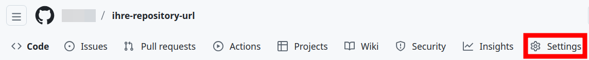

Wählen Sie *Pages* unten links auf dem Bildschirm:

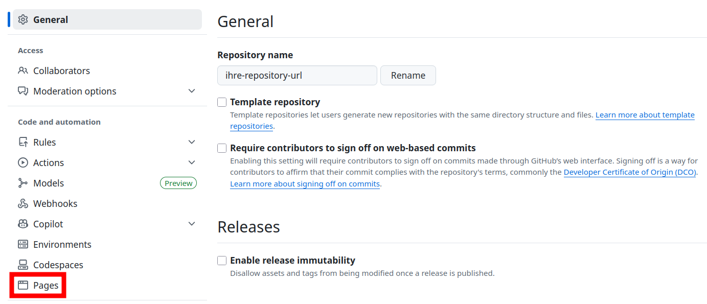

Ändern Sie unter *Source* den Eintrag auf **GitHub Actions**:

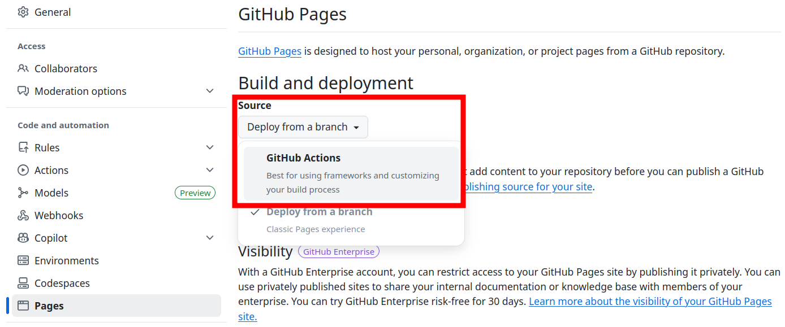

Damit wird festgelegt, dass GitHub Pages nicht aus einem Branch, sondern über einen Actions-Workflow deployed wird.

**Schritt 3: GitHub-Actions-Workflow anlegen**

Für diesen Schritt gibt es zwei Vorgehensweisen:

::: {.panel-tabset}

##### 3a: Über die Browseroberfläche

Nachdem Sie in Schritt 2 auf *GitHub Actions* umgestellt haben, erscheint darunter die Aufforderung vorhandene *Workflows* für die *Action* zu verwenden oder eine eigene zu generieren. Wählen Sie die zweite Option **create your own**:

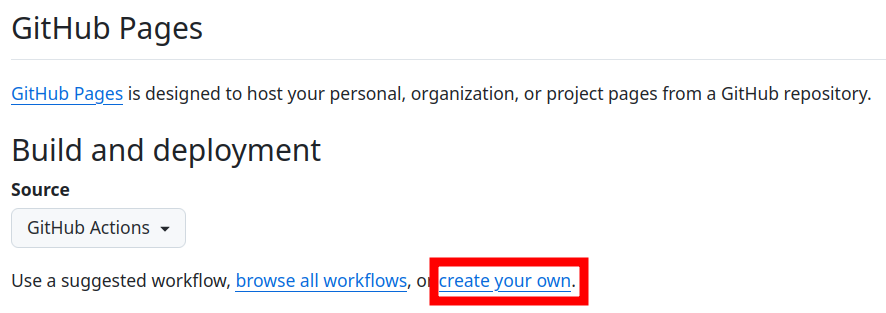

Ein neues Fenster wird geöffnet, das drei Eingaben erwartet:

1.  den Namen des neu zu generierenden *Workflows*. Hier **muss** `quarto-publish.yml` eingetragen werden

2.  Löschen Sie den vorgegebenen Text in dem Feld indem Sie hineinklicken, mit  +  alles auswählen und mit  alles löschen. Kopieren Sie anschließend den Inhalt der **Codebox unten** in das Feld hinein.

3.  Wenn der Dateiname richtig eingetragen und der Inhalt des Textfeldes ersetzt ist, klicken Sie auf *Commit changes...*.

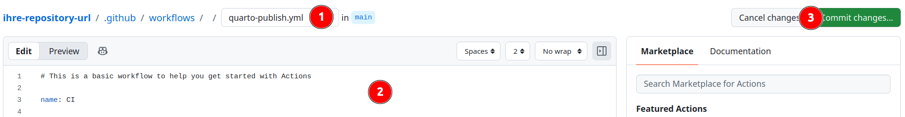

<div class="columns">
<div class="column" style="width:50%">

1. In dem erscheinenden Dialog belassen Sie die *Commit Message* wie vorgegeben oder ändern Sie etwa in `Add GitHub Actions workflow for Quarto Pages`. Damit wird dokumentiert, was die Änderung am Datenbestand umfasst.
2. Beenden Sie den Vorgang mit *Commit changes*. 
Nach dem Commit wird automatisch ein Workflow-Lauf gestartet.
</div>
<div class="column" style="width:50%">
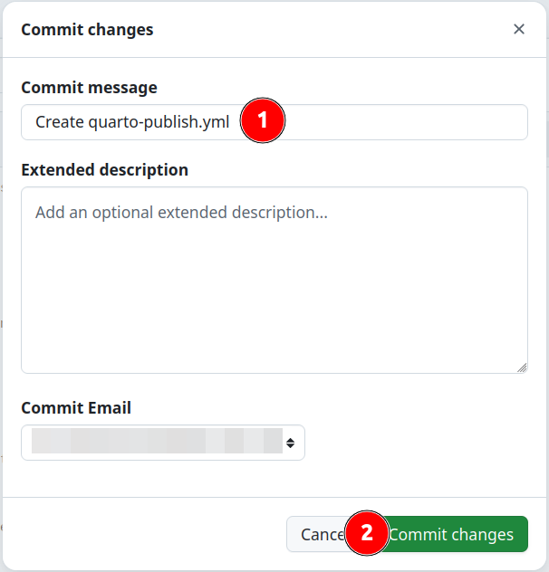
</div>
</div>

##### 3b: Über das Terminal

Legen Sie im lokalen Repository ein neues Unterverzeichnis

`.github/workflows/`

an und erstellen darin eine neue Datei mit der Bezeichnung

`quarto-publish.yml`

Kopieren Sie anschließend den Inhalt der **Codebox unten** in die Datei und speichern Sie diese ab.

Committen und pushen Sie den Workflow über die Konsole:

``` bash
git add .github/workflows/quarto-publish.yml
git commit -m "Add GitHub Actions workflow for Quarto Pages"
git push
```

Nach dem Push wird automatisch ein Workflow-Lauf gestartet.

:::

**Inhalt für die quarto-publish.yml**

``` yaml
name: Quarto-Projekt auf GitHub Pages publizieren

on:
  push:
    branches: [ main ]
  workflow_dispatch:

permissions:
  contents: read
  pages: write
  id-token: write

concurrency:
  group: pages
  cancel-in-progress: true

jobs:
  build:
    runs-on: ubuntu-latest

    steps:
      - name: Repository auschecken
        uses: actions/checkout@v4

      - name: Quarto einrichten
        uses: quarto-dev/quarto-actions/setup@v2

      - name: Projekt rendern
        uses: quarto-dev/quarto-actions/render@v2

      - name: Pages-Artefakt hochladen
        uses: actions/upload-pages-artifact@v3
        with:
          path: _site

  deploy:
    needs: build
    runs-on: ubuntu-latest
    environment:
      name: github-pages
      url: ${{ steps.deployment.outputs.page_url }}

    steps:
      - name: Deployment zu GitHub Pages
        id: deployment
        uses: actions/deploy-pages@v4
```

Nach erfolgreichem Abschluss ist die Website unter der von GitHub angezeigten Pages-URL erreichbar. Nach jeder Änderung oder Aktualisierung der Inhalte im Quarto-Projekt und der Übertragung (commit) in das GitHub-Repository wird die Seite neu generiert. Es empfiehlt sich, die Pages-URL in die Beschreibung des Repositories zu übernehmen. Dann ist sie schnell erreichbar.

::: {.callout-tip title="Nützliche Links"}

**Offizielle Quarto-Dokumentation:**

-   [Quarto: Publishing mit GitHub Pages](https://quarto.org/docs/publishing/github-pages.html)
-   [Quarto: GitHub Actions](https://quarto.org/docs/publishing/github-actions.html)
-   [Quarto: Command Line Interface](https://quarto.org/docs/reference/command-line-interface.html)

**Weiterführende Anleitung:**

-   [Mickaël Canouil: *Quarto – Publishing to GitHub Pages*](https://mickael.canouil.fr/posts/2024-12-30-quarto-github-pages/)

**GitHub Actions für Quarto mit Python, R oder Julia**

Wenn Sie in Ihren OER ausführbaren Code integrieren wollen, muss die GitHub Action entsprechende Umgebungen laden. 

Ausführliche Informationen und Vorlagen dazu bietet die [Quarto-Dokumentation unter *Executing Code*](https://quarto.org/docs/publishing/github-pages.html?utm_source=chatgpt.com#executing-code).

:::


## Bereitstellung über weitere Git-basierte Plattformen {#sec-weitere-git-plattformen}

### Codeberg

#### Einordnung

[Codeberg](https://codeberg.org/) ist eine Alternative zu GitHub. Die Plattform basiert auf freier Software und wird von einer gemeinnützigen Organisation mit Sitz in Berlin betrieben. Damit bietet Codeberg eine Alternative zu kommerziellen Hosting-Plattformen.

Für Projekte im Kontext von Open Science kann Codeberg deshalb interessant sein: Die Plattform verringert Abhängigkeiten von kommerziellen Diensten und passt gut zu Projekten, die freie Software und nachhaltige technische Infrastrukturen bevorzugen.

Der grundsätzliche Unterschied zu der oben beschriebenen Bereitstellung über GitHub Pages liegt in der fehlenden Unterstützung durch Quarto. Für GitHub Pages stellt Quarto mit `quarto publish gh-pages` einen eigenen Veröffentlichungsbefehl bereit. Für Codeberg Pages steht dieser Befehl nicht zur Verfügung.

Die Veröffentlichung auf Codeberg wird deshalb über Forgejo Actions eingerichtet. Ein Workflow rendert das Quarto-Projekt mit `quarto render` und übergibt den erzeugten Ausgabeordner `_site/` an Codeberg Pages. Die dafür nötigen Schritte werden in der Datei `.forgejo/workflows/publish.yml` festgelegt.

#### Voraussetzungen

Für die Veröffentlichung auf Codeberg benötigen Sie einen Codeberg-Account und ein Repository für Ihr Quarto-Projekt. Wesentliche Voraussetzung ist, dass das Projekt lokal fehlerfrei gerendert wird. Prüfen Sie dies vor der Einrichtung des Codeberg-Workflows mit:

```bash
quarto render
```

Damit Sie das lokale Quarto-Projekt mit dem Repository auf Codeberg verbinden können, muss Git auf dem lokalen Rechner eingerichtet sein. Wenn Sie die Verbindung über SSH herstellen, müssen Sie außerdem einen SSH-Schlüssel in Ihrem Codeberg-Account hinterlegen und den SSH-Fingerprint von Codeberg prüfen. Codeberg [beschreibt dieses Vorgehen in der Dokumentation](https://docs.codeberg.org/security/ssh-key/) zu SSH-Schlüsseln und zur Prüfung des SSH-Fingerprints.

#### URLs, Branches und Ausgabeordner

Für die Veröffentlichung über Codeberg Pages sind drei Angaben wichtig:

1. die Adresse des Repositories,
2. die spätere Adresse der Website und
3. der Ausgabeordner des Quarto-Projekts.

Das Quarto-Projekt liegt in einem Codeberg-Repository. Die Repository-Adresse folgt diesem Muster:

`https://codeberg.org/benutzername/repositoryname`

Codeberg kennt neben persönlichen Accounts auch Organisationen. Liegt das Repository in einer Organisation, verwenden Sie statt des Benutzernamens den Namen der Organisation:

`https://codeberg.org/organisationsname/repositoryname`

Die veröffentlichte Website ist später unter einer Codeberg-Pages-Adresse erreichbar. Für ein Projekt-Repository folgt die Adresse diesem Muster:

`https://benutzername.codeberg.page/repositoryname/`

Bei einem Repository in einer Organisation verwenden Sie entsprechend den Organisationsnamen:

`https://organisationsname.codeberg.page/repositoryname/`

Der Workflow wird im Arbeitsbranch des Repositories eingerichtet. In der Regel ist dies der Branch `main`.

Der Ausgabeordner wird in `_quarto.yml` unter `project` mit `output-dir` festgelegt:

```yaml
project:
  type: website
  output-dir: _site
  ```

Im Workflow muss derselbe Ausgabeordner angegeben werden, der in `_quarto.yml` unter `output-dir` festgelegt ist. Im Beispiel ist dies `_site/`.

**Codeberg Actions aktivieren**

Damit der Workflow ausgeführt werden kann, müssen Actions für das Repository aktiviert sein. Öffnen Sie dazu auf Codeberg die Einstellungen des Repositories und suchen Sie den Bereich `Units` > `Overview` bzw. `Einheiten` > `Übersicht`. Aktivieren Sie dort `Actions`.

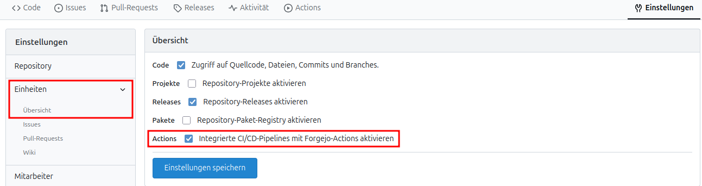{fig-alt="Screenshot der Codeberg-Einstellungen für die Aktivierung der Actions"}

Prüfen Sie anschließend unter `Actions` > `Runners`, ob ein Runner verfügbar ist. Für die hier gezeigten Workflows wird der Runner `codeberg-small` verwendet.

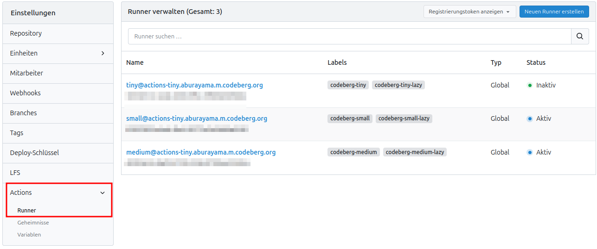{fig-alt=""}

#### Deployment mit Forgejo Actions

Für den automatisierten Workflow müssen Forgejo Actions im Repository verfügbar sein. Der Workflow wird im Repository als Datei `.forgejo/workflows/publish.yml` gespeichert. Er rendert das Projekt und übergibt den erzeugten Ordner `_site/` an Codeberg Pages.

Falls das Projekt ausführbaren Code enthält, müssen die entsprechenden Laufzeitumgebungen im Workflow eingerichtet werden. Das betrifft vor allem R, Python oder Julia. Die passenden Varianten der Workflow-Datei werden im Folgenden gezeigt.

**Neues Repository anlegen**

Initialisieren Sie zunächst im Projektordner ein lokales Git-Repository. Der Branch wird auf `main` gesetzt. Danach werden alle Dateien zum ersten Commit hinzugefügt.

```bash
git init
git branch -M main
git add .
git status
git commit -m "Initial commit"
```

Verbinden Sie anschließend das lokale Repository mit dem zuvor auf Codeberg angelegten Repository. Ersetzen Sie `<owner>` durch den Namen Ihres Accounts oder Ihrer Organisation und `<repo>` durch den Repositorynamen.

```bash
git remote add origin git@codeberg.org:<owner>/<repo>.git
git remote -v
```

Übertragen Sie den lokalen Branch main nach Codeberg. Mit `-u` wird `origin main` als Standardziel für spätere Push- und Pull-Befehle gesetzt.

```bash
git push -u origin main
```

Legen Sie danach im Repository die Workflow-Datei an:

```bash
.forgejo/workflows/publish.yml
```

Diese Datei enthält die Schritte, mit denen Forgejo Actions das Quarto-Projekt rendert und den Ausgabeordner an Codeberg Pages übergibt.


::: {.panel-tabset}

##### Nur Quarto

Diese Variante eignet sich für Quarto-Websites ohne ausführbaren R-, Python- oder Julia-Code. Der Workflow installiert Quarto, rendert das Projekt und veröffentlicht den Ausgabeordner mit Codeberg Pages.

Kopieren Sie folgenden Inhalt in die Datei `.forgejo/workflows/publish.yml`:

```yaml
on:
  push:
    branches:
      - main

jobs:
  publish:
    runs-on: codeberg-small

    steps:
      - uses: actions/checkout@v4

      - name: Install Quarto
        run: |
          wget https://github.com/quarto-dev/quarto-cli/releases/download/v1.9.38/quarto-1.9.38-linux-amd64.deb
          sudo dpkg -i quarto-1.9.38-linux-amd64.deb

      - name: Render Quarto website
        run: quarto render

      - name: Publish to Codeberg Pages
        uses: https://codeberg.org/git-pages/action@v2
        with:
          site: "https://owner.codeberg.page/repo/"
          token: ${{ forge.token }}
          source: _site/
```

Ersetzen Sie `owner` durch den Namen des Accounts oder der Organisation. Ersetzen Sie `repo` durch den Namen des Repositories.

Die Angabe bei `source` muss mit dem Ausgabeordner übereinstimmen, der in `_quarto.yml` mit `output-dir` festgelegt ist. Im Beispiel ist dies `_site/`.

Die Quarto-Version wird im Installationsschritt festgelegt. Prüfen Sie bei Bedarf auf der Quarto-Downloadseite, ob eine neuere Version verfügbar ist. Für reproduzierbare Builds kann es sinnvoll sein, eine feste Version beizubehalten.

##### Quarto mit R

Diese Variante eignet sich für Quarto-Websites mit ausführbarem R-Code. Der Workflow installiert R, installiert bei Bedarf R-Pakete, rendert das Projekt und veröffentlicht den Ausgabeordner mit Codeberg Pages.

Kopieren Sie folgenden Inhalt in die Datei `.forgejo/workflows/publish.yml`:

```yaml
on:
  push:
    branches:
      - main

jobs:
  publish:
    runs-on: codeberg-small

    steps:
      - uses: actions/checkout@v4

      - name: Install Quarto
        run: |
          wget https://github.com/quarto-dev/quarto-cli/releases/download/v1.9.38/quarto-1.9.38-linux-amd64.deb
          sudo dpkg -i quarto-1.9.38-linux-amd64.deb

      - name: Install R
        run: |
          sudo apt-get update
          sudo apt-get install -y r-base

      - name: Install R packages
        run: |
          sudo Rscript -e 'install.packages(c("knitr"), repos = "https://cloud.r-project.org")'

      - name: Render Quarto website
        run: quarto render

      - name: Publish to Codeberg Pages
        uses: https://codeberg.org/git-pages/action@v2
        with:
          site: "https://owner.codeberg.page/repo/"
          token: ${{ forge.token }}
          source: _site/
```

Ersetzen Sie `owner` durch den Namen des Accounts oder der Organisation. Ersetzen Sie `repo` durch den Namen des Repositories.

Ergänzen Sie im Schritt `Install R packages` alle R-Pakete, die Ihr Quarto-Projekt beim Rendern benötigt. Für R-Codeblöcke in Quarto wird mindestens `knitr` benötigt. Weitere Pakete hängen vom konkreten Projekt ab und können in der entsprechenden Anweisung in der `publish.yml` nach `"knitr"` mit Kommata getrennt einfach ergänzt werden.

Die Angabe bei `source` muss mit dem Ausgabeordner übereinstimmen, der in `_quarto.yml` unter `output-dir` festgelegt ist. Im Beispiel ist dies `_site/`.

##### Quarto mit Python

Diese Variante eignet sich für Quarto-Websites mit ausführbarem Python-Code. Der Workflow installiert Python, installiert bei Bedarf Python-Pakete, rendert das Projekt und veröffentlicht den Ausgabeordner mit Codeberg Pages.

Kopieren Sie folgenden Inhalt in die Datei `.forgejo/workflows/publish.yml`:

```yaml
on:
  push:
    branches:
      - main

jobs:
  publish:
    runs-on: codeberg-small

    steps:
      - uses: actions/checkout@v4

      - name: Install Quarto
        run: |
          wget https://github.com/quarto-dev/quarto-cli/releases/download/v1.9.38/quarto-1.9.38-linux-amd64.deb
          sudo dpkg -i quarto-1.9.38-linux-amd64.deb

      - name: Install Python
        run: |
          sudo apt-get update
          sudo apt-get install -y python3 python3-pip python3-venv

      - name: Install Python packages
        run: |
          python3 -m venv .venv
          . .venv/bin/activate
          python -m pip install --upgrade pip
          python -m pip install jupyter

          if [ -f requirements.txt ]; then
            python -m pip install -r requirements.txt
          fi

      - name: Render Quarto website
        run: |
          . .venv/bin/activate
          quarto render

      - name: Publish to Codeberg Pages
        uses: https://codeberg.org/git-pages/action@v2
        with:
          site: "https://owner.codeberg.page/repo/"
          token: ${{ forge.token }}
          source: _site/
```

Ersetzen Sie `owner` durch den Namen des Accounts oder der Organisation. Ersetzen Sie `repo` durch den Namen des Repositories.

Legen Sie bei Bedarf im Hauptverzeichnis des Repositories eine Datei `requirements.txt` an. Sie liegt auf derselben Ebene wie `_quarto.yml`. Tragen Sie dort alle Python-Pakete ein, die Ihr Quarto-Projekt beim Rendern benötigt.

Für Python-Codeblöcke in Quarto wird mindestens `jupyter` benötigt. Dieses Paket wird im Workflow bereits unabhängig von `requirements.txt` installiert. In `requirements.txt` müssen Sie deshalb nur die zusätzlichen Pakete eintragen, die in Ihrem Projekt verwendet werden.

Eine einfache `requirements.txt` kann zum Beispiel so aussehen:

```text
pandas
matplotlib
plotly
```

Der Workflow prüft, ob die Datei `requirements.txt` vorhanden ist. Wenn die Datei existiert, installiert er die darin aufgeführten Pakete vor dem Rendern der Website.

Die Angabe bei `source` muss mit dem Ausgabeordner übereinstimmen, der in `_quarto.yml` unter `output-dir` festgelegt ist. Im Beispiel ist dies `_site/`.

##### Quarto mit Julia

Diese Variante eignet sich für Quarto-Websites mit ausführbarem Julia-Code. Der Workflow installiert Julia, installiert bei Bedarf Julia-Pakete, rendert das Projekt und veröffentlicht den Ausgabeordner mit Codeberg Pages.

Damit Quarto die Julia-Engine verwendet, muss in `_quarto.yml` oder im YAML-Header der betreffenden `.qmd`-Datei `engine: julia` gesetzt sein.

Kopieren Sie folgenden Inhalt in die Datei `.forgejo/workflows/publish.yml`:

```yaml
on:
  push:
    branches:
      - main

jobs:
  publish:
    runs-on: codeberg-small

    steps:
      - uses: actions/checkout@v4

      - name: Install Quarto
        run: |
          wget https://github.com/quarto-dev/quarto-cli/releases/download/v1.9.38/quarto-1.9.38-linux-amd64.deb
          sudo dpkg -i quarto-1.9.38-linux-amd64.deb

      - name: Install Julia
        uses: julia-actions/setup-julia@v3
        with:
          version: "1"

      - name: Install Julia packages
        run: |
          julia --project=. -e 'using Pkg; Pkg.instantiate()'

      - name: Render Quarto website
        run: quarto render

      - name: Publish to Codeberg Pages
        uses: https://codeberg.org/git-pages/action@v2
        with:
          site: "https://owner.codeberg.page/repo/"
          token: ${{ forge.token }}
          source: _site/
```

Ersetzen Sie `owner` durch den Namen des Accounts oder der Organisation. Ersetzen Sie `repo` durch den Namen des Repositories.

Legen Sie bei Bedarf im Hauptverzeichnis des Repositories eine Julia-Projektumgebung an. Die Dateien `Project.toml` und, wenn vorhanden, `Manifest.toml` liegen auf derselben Ebene wie `_quarto.yml`. Tragen Sie dort alle Julia-Pakete ein, die Ihr Quarto-Projekt beim Rendern benötigt.

Der Schritt `Install Julia packages` aktiviert die Projektumgebung im Hauptverzeichnis und installiert die darin festgelegten Pakete. Wenn keine `Project.toml` vorhanden ist, löschen Sie diesen Schritt vollständig aus der Workflow-Datei.

Die Angabe bei `source` muss mit dem Ausgabeordner übereinstimmen, der in `_quarto.yml` unter `output-dir` festgelegt ist. Im Beispiel ist dies `_site/`.


:::

Nachdem Sie die Datei `.forgejo/workflows/publish.yml` entsprechend den Anforderungen Ihres Projekts ergänzt haben, übertragen Sie die Änderungen in das Codeberg-Repository:

```bash
git add .
git commit -m "Add CI workflow"
git push
```

#### Veröffentlichung prüfen

Nach dem Push startet Forgejo Actions den Workflow automatisch. Öffnen Sie die Actions-Übersicht des Repositories:

`https://codeberg.org/owner/repo/actions`

Prüfen Sie dort, ob der Workflow erfolgreich abgeschlossen wurde. Wenn der Workflow erfolgreich war, rufen Sie die veröffentlichte Website im Browser auf:

`https://owner.codeberg.page/repo/`

Falls die Website nicht erreichbar ist oder nicht korrekt dargestellt wird, prüfen Sie den Workflow-Log in Codeberg. 

